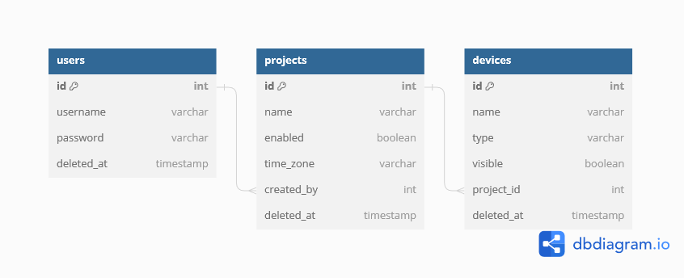

## Dependencias de Producción

- **apollo-server-express**
- **bcrypt**
- **dotenv**
- **express**
- **graphql**
- **jsonwebtoken**
- **pg**

## Dependencias de Desarrollo

- **nodemon**

## Scripts Disponibles

- **dev**: Inicia el servidor utilizando nodemon para reiniciar automáticamente cuando se realizan cambios en el código. Ejecute con `npm run dev`.
- **start**: Inicia el servidor utilizando el comando `node index.js`. Ejecute con `npm start`.
- **extra**: Ejecuta un script adicional ubicado en `./backend/extra/extra.js` utilizando nodemon para reiniciar automáticamente. Ejecute con `npm run extra`.

# Esquema de Base de Datos

Este repositorio contiene el esquema de base de datos para una prueba de backend de la empresa Horus Smart Energy. El esquema incluye tablas para Usuarios, Proyectos y Dispositivos.

Para ver el esquema detallado de la base de datos, incluyendo tablas y relaciones, por favor visita el siguiente enlace:

[Ver Esquema de Base de Datos en dbdiagram](<https://dbdiagram.io/d/horus_smart_energy-65da28455cd0412774b96291>)

# Documentación de la API

En la carpeta "extra" se encuentra un archivo JSON que contiene la documentación de la API creada en Postman. Esta documentación detalla todos los endpoints, métodos, parámetros y respuestas de la API.

Para acceder a la documentación detallada de la API, consulta el archivo JSON ubicado en la carpeta "extra" el archivo se llama Horus."postman_collection.json".

